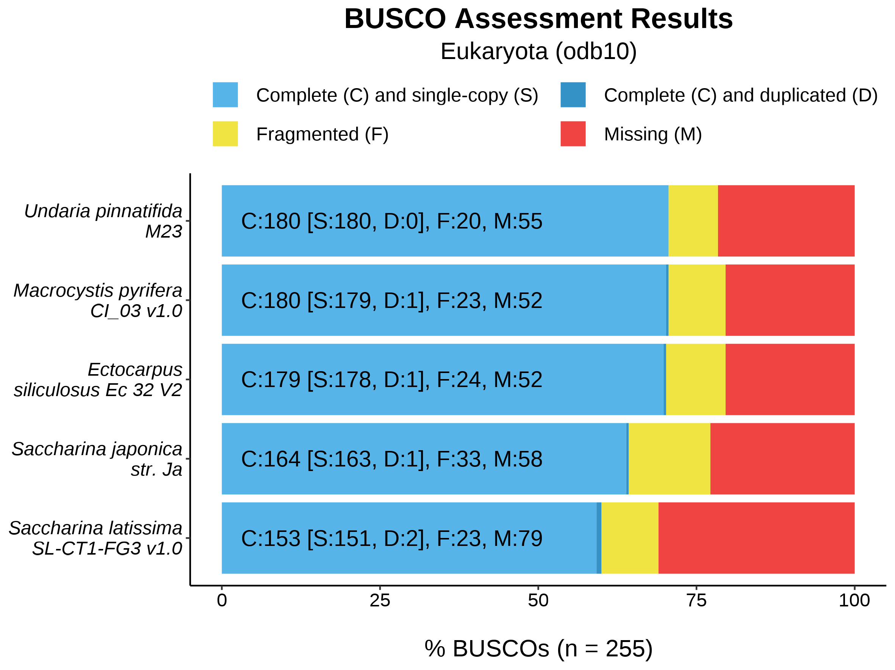
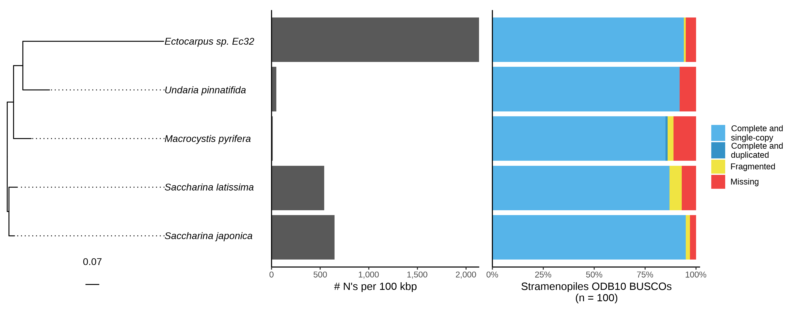
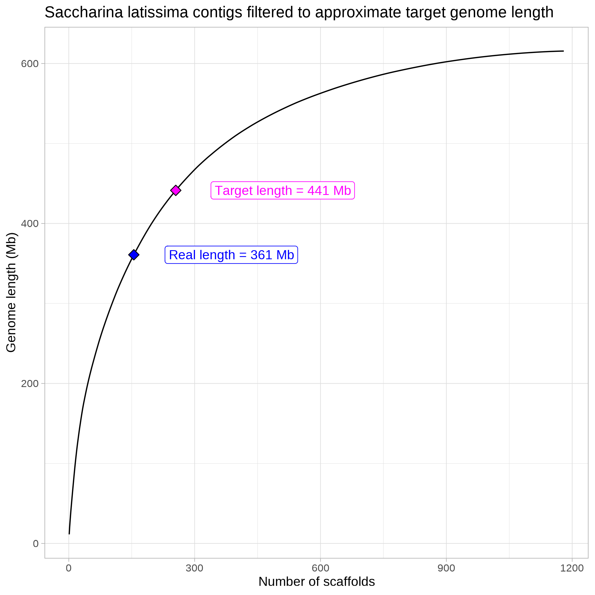
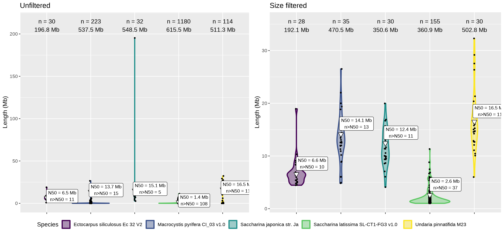
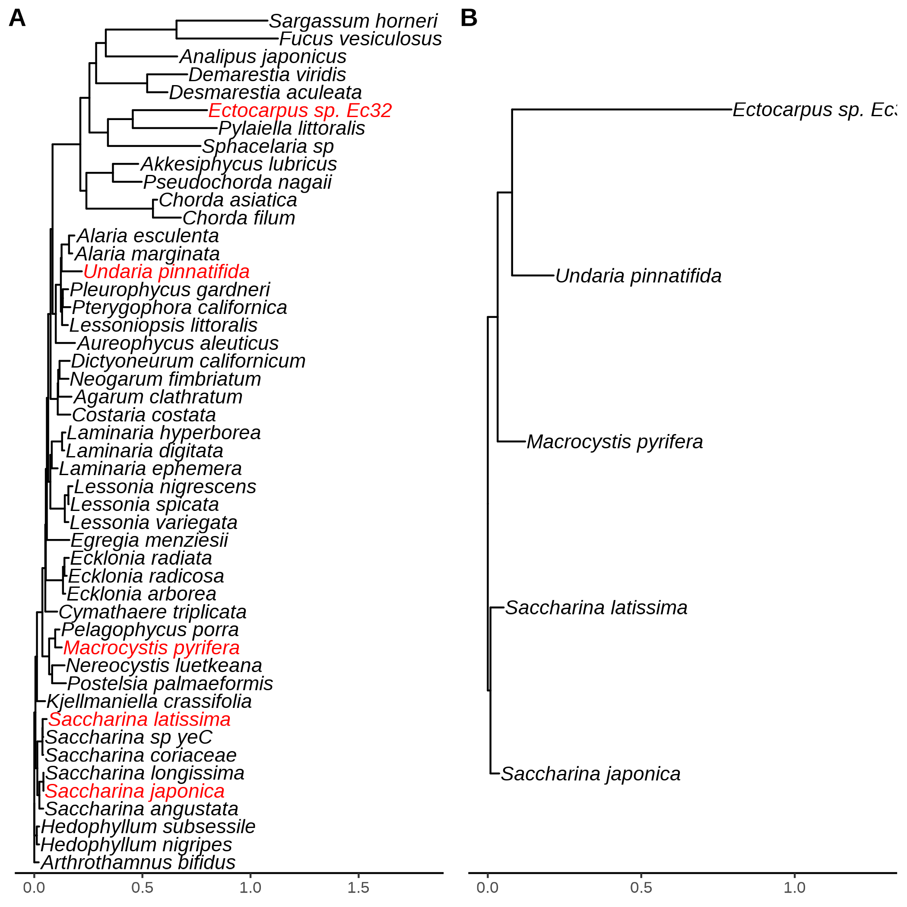
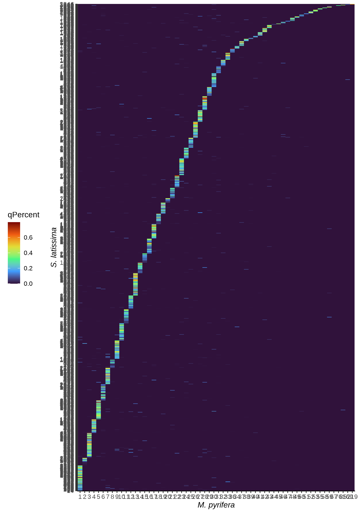
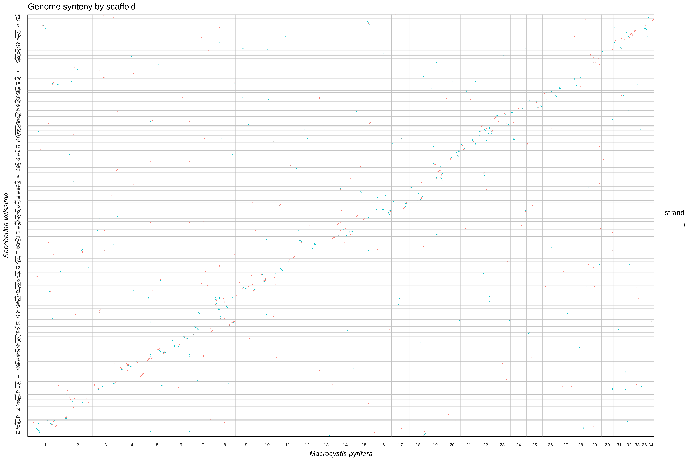

# Genome assembly of the brown macroalga *Saccharina latissima* (North American sugar kelp)
Scripts to score and compare the genome assembly of *S. latissima* to related species.

## 1. Input files
Fetch assemblies and annotations from
[JGI PhycoCosm](https://phycocosm.jgi.doe.gov/phycocosm/home) and
[ORCAE](https://bioinformatics.psb.ugent.be/orcae) given a list of JGI portal
names and ORCAE links.
##### Usage
###### Option 1: Give JGI username and password
sbatch fetch_assemblies.sbatch [<portal_list>](portal_names.txt) [username] [password]
###### Option 2: Give pre-generated curl login file for JGI
sbatch fetch_assemblies.sbatch [<portal_list>](portal_names.txt) [curl_login_file]
##### Example
```
sbatch s-latissima-genome/fetch_assemblies.sbatch s-latissima-genome/portal_names.txt jgi_login
```
Upon successful download, the output directory `assemblies/` and
[<assembly_file>](species_table.txt) will be created.

Assembly file format:

Species name  | Genome FASTA | Annotation file | Protein FASTA | Gene info file | ...
------------- | ------------ | --------------- | ------------- | -------------- | ---
Species 1     | PATH1        | PATH1           | PATH1         | PATH1          | ...
Species 2     | PATH2        | PATH2           | PATH2         | PATH2          | ...

## 2. Genome scoring with BUSCO and QUAST
Run BUSCO and QUAST on each assembly listed in `<assembly_file>`:
##### Usage
bash genome_stats.sh [<assembly_file>](species_table.txt)
[[path/to/aug_busco.sbatch]](aug_busco.sbatch)
[[path/to/quast.sbatch]](quast.sbatch)
##### Example
```
bash s-latissima-genome/genome_stats.sh s-latissima-genome/species_table.txt s-latissima-genome/aug_busco.sbatch s-latissima-genome/quast.sbatch
```
Visualize BUSCO results:
##### Usage
bash genome_stats.sh [<assembly_file>](species_table.txt) [[path/to/busco_compare.sbatch]](busco_compare.sbatch)
For each lineage, a plot of BUSCO results across all genomes will be saved to
`busco_<lineage>.png`.
##### Example
```
bash s-latissima-genome/genome_stats.sh s-latissima-genome/species_table.txt s-latissima-genome/busco_compare.sbatch
```



## 3. Evaluation of scaffoldedness and contig size filtering
Generates violin plots of contig size for each genome, then filters out
extremely large or small (>1 Mb) contigs.
##### Usage
sbatch chromosome_extract.sbatch [<assembly_file>](species_table.txt)
\<species_of_interest\> \<outgroup_species\>

> **Note**: Ensure `<species_of_interest>` and `<outgroup_species>` are in the format "Genus_specificname" and do not contain spaces.

Resulting filtered genomes will be tabulated next to species names in
`filt_species_table.txt`. A curve of filtered length and contig number for the
species of interest will be saved to `<species_of_interest>_filtering.png`.
Violin plots of contig sizes before and after filtering will be saved in
`scaffold_sizes_violin.png`.
##### Example
```
sbatch s-latissima-genome/chromosome_extract.sbatch s-latissima-genome/species_table.txt Saccharina_latissima Ectocarpus_siliculosus
```



## 4. Multi-species whole genome alignment with Cactus Progressive Aligner
### Prune brown macroalgae phylogeny to include only species in analysis
Default
[tree](https://ars.els-cdn.com/content/image/1-s2.0-S1055790319300892-mmc1.txt)
sourced from
[Starko, S. et al. 2019](https://doi.org/10.1016/j.ympev.2019.04.012).
##### Usage
sbatch [prune_tree.sbatch](prune_tree.sbatch)
[<assembly_file>](species_table.txt)
[[tree]](https://ars.els-cdn.com/content/image/1-s2.0-S1055790319300892-mmc1.txt)
##### Example
```
sbatch s-latissima-genome/prune_tree.sbatch s-latissima-genome/species_table.txt 1-s2.0-S1055790319300892-mmc1.txt
```
Output `<seqFile>` formatted for Cactus: `s_lat_alignment.txt`.
Phylogeny before and after pruning will be plotted in `phylo_prune.png`.


### Run Cactus aligner
#### Prepare scripts for stepwise pipeline
##### Usage
sbatch [cactus_prepare.sbatch](cactus_prepare.sbatch) [<seqFile>](s_lat_alignment.txt)
##### Example
```
sbatch s-latissima-genome/cactus_prepare.sbatch s-latissima-genome/s_lat_alignment.txt
```
#### Run scripts sequentially
sbatch [cactus_run_prepared.sbatch](cactus_run_prepared.sbatch) [sbatch_list_file](cactus_sbatch_list.txt)
##### Example
```
sbatch s-latissima-genome/cactus_run_prepared.sbatch s-latissima-genome/cactus_sbatch_list.txt
```
### Visualize alignments
#### Run halSynteny to extract syntenic blocks between each genome pair
##### Usage
sbatch [halSynteny.sbatch](halSynteny.sbatch) \<inHal\>
##### Example
```
sbatch s-latissima-genome/halSynteny.sbatch cactus-steps-output/s_lat_alignment.hal
```
#### Generate heatmaps and dotplots of pairwise halSynteny PSL files
Description of PSL file format taken from [Ensembl](https://useast.ensembl.org/info/website/upload/psl.html).
##### Usage
sbatch [dotplot.sbatch](dotplot.sbatch) [<seqFile>](s_lat_alignment.txt)
##### Example
```
sbatch s-latissima-genome/dotplot.sbatch s-latissima-genome/s_lat_alignment.txt
```



## 5. Homology-based rescaffolding
### Extract MAF from Cactus alignment using [HAL tools](https://github.com/ComparativeGenomicsToolkit/hal)
##### Usage
sbatch [hal2maf.sbatch](hal2maf.sbatch) \<halFile\>
##### Example
```
sbatch s-latissima-genome/hal2maf.sbatch cactus-steps-output/s_lat_alignment.hal
```
### Rescaffold assembly v1.0 with [Ragout](https://github.com/fenderglass/Ragout)
#### Build Ragout recipe file

##### Usage
sbatch [ragout.sbatch](ragout.sbatch) [<seqFile>](s_lat_alignment.txt) \<cactus_dir\> [ragout_prefix]
##### Example
```
sbatch s-latissima-genome/ragout.sbatch s-latissima-genome/s_lat_alignment.txt cactus-steps-output ragout-out
```
## 6. Identify orthologous genes with OrthoFinder
### Run OrthoFinder on all brown algal species
##### Usage
sbatch [orthofinder.sbatch](orthofinder.sbatch) [<assembly_file>](species_table.txt)
##### Example
```
sbatch s-latissima-genome/orthofinder.sbatch s-latissima-genome/species_table.txt
```
